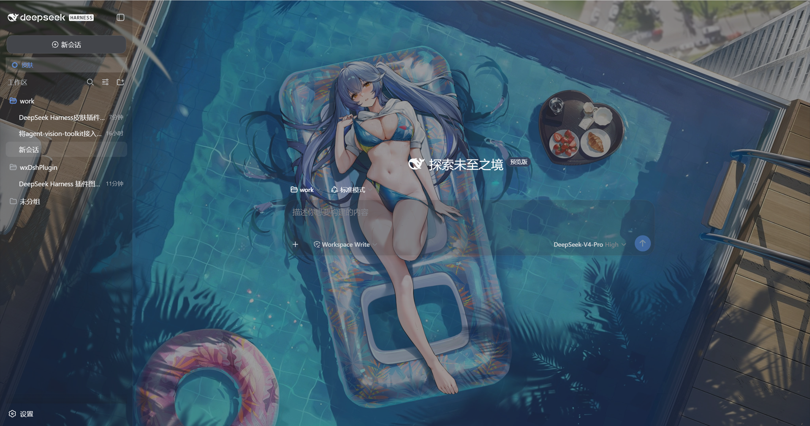

# 🎨 dsh-wx-skin

**DeepSeek Harness（DSH）Web GUI 皮肤插件** —— 侧栏「皮肤」面板，自选本地图片或图片 URL 作为全屏磨砂背景，支持预设、暗化、模糊与透出调节，明暗主题自动适配，跨刷新持久化。




> 上图为本插件实际效果演示(深蓝渐变壁纸透过半透明表面)。`assets/demo.html` 是自包含的演示源,可直接用浏览器打开预览。

---

## ✨ 功能特性

- **侧栏「皮肤」入口**,点击弹出设置面板(浮层,不遮挡聊天内容);旁边另有「下一张」入口,不打开面板也能一键换图。
- **本地图片**:浏览器原生文件对话框选择 PNG / JPEG / WebP / GIF / BMP,**不限文件大小**;按显示需要编码(≤4096px 保持原始分辨率,更大的自动缩放以保证浏览器可绘制、可持久化),选中后点「应用」生效。
- **图片 URL**:粘贴 `http(s)://` 图片地址直接应用。
- **文件夹轮播**:指定一个本地文件夹(可调用 harness 的宿主目录选择器,也可手填绝对路径),插件读盘列出其中所有图片并**缓存路径**;「下一张」按你选的模式换图:
  - **顺序**:按文件名自然排序(数值感知,`img2` 在 `img10` 之前)依次推进,到底回绕;
  - **随机**:从未切换的图片里等概率抽取;
  - **一轮内不重复**:已切换过的图片会被记录,只有本轮图片全部切过之后才重置队列;重置后的第一张不会与当前这张重复(只有一张时除外)。
  - 可选「包含子文件夹」;单次最多缓存 2000 张、遍历 20000 项、递归深度 6,达上限时面板会提示已截断。
- **背景来源下拉框**:面板顶部一个下拉框在「图片」与「文件夹」之间切换,分别只显示「选择图片 / 图片 URL / 预设」或「文件夹路径 / 顺序随机 / 下一张 / 本轮进度」,面板不再把所有控件堆在一起(效果滑杆与「恢复默认」始终可见)。
- **当前图片名称**:面板在「当前：」下方显示正在使用的图片名称——文件夹显示当前那张的文件名、本地图片显示所选文件名、URL 显示路径末段(如 `photo.jpg`)、预设显示预设名;过长自动省略,悬停可看到完整路径 / URL;未启用或没有背景时不显示这一行。侧栏「下一张」入口的悬停提示也带上当前名称。
- **预设皮肤**:墨蓝 / 石板 / 暖沙 / 落日渐变 / 深海渐变 / 极光渐变。
- **效果调节**:
  - 暗化 0–80%(黑色遮罩,保证文字可读);
  - 模糊 0–24px(背景毛玻璃);
  - **透出 0–100%**(表面不透明度,越低背景越明显,默认 72%;可读性由「暗化」配合)。
- **启用开关 + 恢复默认**,一键关闭皮肤。
- **持久化**:设置同时存于 `localStorage` 与宿主副本 `~/.dsh/dsh-wx-skin.settings.json`,刷新、重启、桌面端换端口后均自动恢复;文件夹轮播的图片列表、当前序号、本轮已用记录同样持久化(只存路径,不存图片本体,不占 localStorage 配额)。
- **明暗主题适配**:随 `body[data-ds-dark-theme]` 自动切换两套半透明配色;设置面板自身也跟随明暗主题(暗色模式为不透明深色卡片 + 浅色文字),`color-scheme` 让面板内的勾选框、滑杆、滚动条与面板同色系。
- **参与 harness 生命周期**:浏览器半区通过 `ctx.effect` 注册挂载,client-hmr 重载或插件行停用时会被完整卸载(入口、面板、背景层、样式表全部移除,不残留、不重复)。
- **完全独立**:纯浏览器端 client 插件,不修改 DSH 仓库,不影响主界面与其它插件。

---

## 📦 安装

前置条件:已安装 [deepseek-harness](https://github.com/deepseek-ai/deepseek-harness) 并初始化 web profile。

### 方式一:从 npm 安装(推荐)

插件已发布到 npm,一条命令装齐(在 **DSH 源码 checkout 目录**执行):

```sh
pnpm dsh plugin --profile web add dsh-wx-skin@0.1.4
# 若 `dsh` 已加入 PATH,也可直接:
dsh plugin --profile web add dsh-wx-skin@0.1.4
```

### 方式二:使用发布包(tarball)

下载 `dsh-wx-skin-0.1.4.tgz`(或通过 GitHub Releases 获取):

```sh
pnpm dsh plugin --profile web add file:<tgz 的绝对路径>
# 例如:
pnpm dsh plugin --profile web add file:C:/Users/you/Downloads/dsh-wx-skin-0.1.4.tgz
```

### 方式三:克隆源码构建(开发者)

```sh
git clone <本仓库地址>
cd dsh-wx-skin
npm install
npm run build

# 装进 web profile(从 DSH 源码 checkout 目录执行)
pnpm dsh plugin --profile web add link:<本目录绝对路径>
```

### 完成安装后

**重启 `dsh web`**,刷新 `http://127.0.0.1:3080`,侧栏出现「皮肤」入口即可使用。

验证是否挂载:

```sh
pnpm dsh --profile web --dump-config   # 应看到 "# == dsh-wx-skin" 层
```

---

## 🚀 使用

1. 点击侧栏「皮肤」打开面板。
2. **选背景**:先用顶部「背景来源」下拉框选择「图片」或「文件夹」,面板只显示该分组对应的控件(效果滑杆与恢复默认始终可见):
   - 点「选择图片」→ 选择本地图片 → 显示缩略图 → 点「应用」;
   - 或粘贴图片 URL → 点「应用」;
   - 或**加载文件夹**:点「选择文件夹」(调用宿主目录选择器)或直接粘贴绝对路径 → 点「加载」→ 面板显示 `第 n/N 张 · 本轮已用 m/N`;
   - 或直接点一个预设色板。
3. **换图**:点面板里的「下一张」,或侧栏「下一张」入口(无需打开面板);切换方式在「顺序 / 随机」之间选;「重新加载」重新读盘以纳入新增/删除的文件,「重置本轮」清空已用记录。**未加载任何文件夹时「下一张」什么都不做**(侧栏入口置灰并提示先加载文件夹),不会弹出任何面板或对话框。
4. **调效果**:拖动「暗化」「模糊」「透出」滑杆实时预览。
5. 「启用皮肤」开关控制总开关;「恢复默认」一键还原(同时清空文件夹缓存)。

> ⚠️ 文件夹轮播需要**宿主半区**读盘,因此首次升级到 0.1.4 后要**重启一次 `dsh web`**;只改浏览器半区时才可依赖 client-hmr 热重载。

---

## 🗑️ 卸载

```sh
pnpm dsh plugin --profile web remove dsh-wx-skin
```

重启 `dsh web` 后入口消失,皮肤设置一并清除。

---

## ⚙️ 工作原理

- **形态**:外部 client 插件(参考 [dsh-web-ui](https://github.com/zhu1090093659/dsh-web-ui) 模式)——`package.json` 声明 `dsh.client`(浏览器半区)+ `dsh.bundle.patch`(`cordis.patch.yml` 插入加载行),构建产物经 tsdown 输出为 `lib/client.js`,由 DSH 的 client-modules 经 `/plugins/??<id>/client.js&rev=<rev>` 组合端点提供(DSH 0.1.5 起带 `rev`;0.1.6 起 `rev` 为启动期不透明版本号,并由 client-hmr 轮询 bundle 变更后热重载)。
- **生命周期**:`src/client/index.ts` 的 `apply(ctx)` 用 `ctx.effect(() => mountSkin(), 'dsh-wx-skin: skin mount')` 注册挂载。harness 的客户端热重载(client-hmr)与插件行停用都是“先卸载旧 fiber(跑 disposer)、删掉该插件拥有的 `<style data-plugin>`,再重新 apply”,因此必须把清理交给 fiber:否则每次重载都会多出一个「皮肤」入口并泄漏 body 级 MutationObserver。挂载失败时记录日志并 `teardownSkinDom()` 清理半成品,绝不外抛。
- **背景层**:注入全屏 `div[data-wx-skin-layer]`(`position: fixed; z-index: 0; pointer-events: none`),并将应用根 `#root` 抬到 `z-index: 1`。⚠️ 实测 **`z-index: -1` 的 fixed 图层在 DSH shell 中不绘制**(落在 canvas 背景之下),这是早期版本"能选图但背景不显示"的根因,故采用 `z-index: 0` + `#root` 抬升方案。
- **半透明表面**:以独立 `<style>` + `!important` 覆盖十余个 alias 表面 token(`--dsw-alias-bg-*`、`--dsw-specific-*`、`--dsw-alias-markdown-*` 等),明暗两套值;透明度由 `--wx-skin-surface` 变量统一控制(不依赖 `color-mix()`,任意现代浏览器可用)。该样式表带 `data-plugin="dsh-wx-skin"` 归属标记(与官方 CSS loader 一致):client-modules 会把未标记的 `<style>` 认领给下一个物化的插件,client-hmr 又按此属性删除插件拥有的样式,不标记就可能被别的插件连带删除。
- **图片管线**:canvas 解码 → 编码为 JPEG data URL;原始分辨率 ≤4096px 时保持原样,更大或超出浏览器存储容量时静默缩小;编码结果做有效性校验,异常自动降档重编——**永不因图片大小报错**。
- **宿主持久化**:`src/index.ts` 通过 `webServer` 服务注册 `/dsh-wx-skin/load` 与 `/dsh-wx-skin/save` 两条回环路由,把设置原子写入 DSH home(`$DSH_HOME` 或 `~/.dsh`)下的 `dsh-wx-skin.settings.json`;桌面端每次启动端口变化、localStorage 清空时,客户端自动从宿主副本恢复——背景图片跨会话不丢失。
- **文件夹轮播**:
  - `POST /dsh-wx-skin/folder` 读盘扫描(可选递归),只收 `png/jpg/jpeg/webp/gif/bmp`,跳过隐藏项与符号链接,按 `rel` 自然排序后返回路径列表;上限 2000 张 / 20000 项 / 深度 6,超限返回 `truncated`。客户端把列表、当前序号、本轮已用路径一起持久化(只存路径)。
  - `GET /dsh-wx-skin/image?p=<绝对路径>&v=<mtime>` 逐个回传图片字节,**只服务上一次成功扫描的根(或设置文件里的 `folderPath`)之内的文件**:`realpath` 归一 + 分隔符前缀比较(Windows 忽略大小写)+ 扩展名白名单 + 必须是文件;`v` 用 mtime 做缓存令牌,文件改动即换 URL。跨站请求(`Sec-Fetch-Site: cross-site`)直接拒绝,响应带 `X-Content-Type-Options: nosniff`。
  - 切换算法在 `src/client/skin-folder.ts`(纯函数、注入 rng):顺序模式按索引向后推进,随机模式在**未切换集合**中等概率抽取;集合为空时才开启新一轮,并排除当前这张以避免立即重复。已切换记录按路径而非下标保存,文件夹内容变化时自动丢弃失效项。
   - 「选择文件夹」按钮调用 harness 客户端服务 `uiWorkspace.pickDirectory()`。该服务由 `ui-workspace` 提供,而它自己 inject 了 `remote.directoryPicker` 等依赖,即**只有客户端↔宿主连接就绪后才会 provide**——比本插件的 `apply` 晚。因此插件用 `ctx.inject(['uiWorkspace'], scope => …)` 把它当作**作用域可选依赖**(不是插件的 `inject`,插件不会因此等待),并通过 `src/client/skin-picker.ts` 的桥**懒读取**:服务到达/离开时通知面板重渲染,按钮始终可见,未就绪时置灰并提示;缺失或不可用时仍可用手填路径。
   - 面板内「下一张」在未加载文件夹时禁用;侧栏「下一张」入口同样置灰(`data-empty`)且点击不产生任何副作用。
- **不依赖 `ctx.theme` 服务**:皮肤完全独立于 DSH 主题系统,关闭时样式惰性、默认主题不受影响。
- **面板配色**:设置面板是不透明浮层,自带一套语义变量 `--wx-panel-*`(浅色默认 + `body[data-ds-dark-theme]` 覆盖),面板区**刻意不引用 `--dsw-alias-*`**:alias 令牌会随主题反转(暗色下 `--dsw-alias-label-primary` 近白、`--dsw-alias-border-l1` 近透明),而面板底色固定,二者叠加就会出现"浅底浅字"。每个变量都带与官方 `--dsw-static-*` 令牌等值的字面量回退,并由 `tests/panel-theme.spec.ts` 校验两套调色板的文字对比度(≥4.5:1)与结构。

---

## 🛠️ 开发

```sh
npm install          # 安装依赖
npm run typecheck    # tsc 类型检查(宿主 + 客户端)
npm run test         # vitest 单元测试(skin-store / skin-folder / folder-scan / skin-host / client-lifecycle / panel-theme)
npm run build        # tsc 宿主 lib + tsdown client bundle
npm pack             # 产出发布包 dsh-wx-skin-<version>.tgz
```

改完源码:`npm run build` → 重启 `dsh web` → 刷新页面。仅改浏览器半区(`lib/client.js`)时,harness 的 client-hmr 会轮询 bundle 变更并热重载该行,不必重启服务。

---

## 📁 项目结构

```
dsh-wx-skin/
├── assets/
│   ├── demo.png          # README 效果截图
│   └── demo.html         # 自包含演示页(浏览器直接打开)
├── src/
│   ├── index.ts          # 宿主半区:设置持久化 + 文件夹扫描 + 图片回传路由
│   ├── folder.ts         # 宿主:文件夹扫描 / 位图白名单 / 路径收敛(io 注入,可测)
│   ├── core/types.ts     # 共享类型(SkinSettings / SkinFolderImage)
│   └── client/
│       ├── index.ts      # 浏览器半区入口(ctx.effect 注册挂载 + 失败清理)
│       ├── mount.tsx     # 侧栏「皮肤」/「下一张」入口 + 面板宿主(自愈挂载、单一 commit)
│       ├── SkinPanel.tsx # 受控设置面板(背景来源下拉:图片 / 文件夹,分组显示)
│       ├── skin-folder.ts # 纯逻辑:排序、图片 URL、去重切换算法(注入 rng)
│       ├── skin-store.ts # 纯逻辑:默认值、localStorage、预设、CSS 变量映射
│       ├── skin-host.ts  # 宿主调用(load / save / folder,loopback fetch,可注入)
│       ├── image-pipeline.ts # 图片 → 降采样 → data URL(依赖注入,可测)
│       ├── skin-dom.ts   # 全局样式 / 背景层 / 应用与卸载到文档
│       ├── global-skin-css.ts # 皮肤全局样式表(背景层 + 半透明表面 + 明暗适配)
│       └── skin.module.css   # 面板 / 侧栏入口样式
├── tests/                # vitest 测试(含 client-lifecycle 挂载契约与 panel-theme 调色板守卫)
├── cordis.patch.yml      # 插件加载行补丁
└── package.json          # dsh.client / dsh.bundle.patch 声明
```

---

## 📋 兼容性与注意事项

- **DSH 版本**:适配基准为 DSH `0.1.6-alpha.1`(checkout `dsh-v0.1.6-alpha.1-5-g0d1f50007f`,2026-10)。逐项核对过的契约:闭包工厂产物 `window.__ModuleLoader__.load({id,factory})`、平台模块表种子词(`react` / `react/jsx-runtime` / `react-dom/client`)、combo 端点 `/plugins/??<id>/client.js&rev=<rev>`、`dsh.client.platform === 'web'` 与 `dsh.bundle.patch` 清单、`webServer.register({kind:'exact'})`、cordis `ctx.effect` / `ctx.logger`、`body[data-ds-dark-theme]`、`#root` 挂载根,以及本插件覆盖的全部 `--dsw-*` 令牌。侧栏入口另依赖 shell 的 DOM 结构(`[class*="sidebarCol"]` / `[class*="logoRow"]` / `[class*="newSession"]`,CSS Modules 哈希命名保证子串可匹配)。若 DSH 版本变更导致入口未出现,只会记录日志、不影响 GUI,可反馈后调整选择器。
- **生命周期约定**:插件必须通过 `ctx.effect` 归还副作用。client-hmr 重载与插件行停用都会先卸载旧 fiber,只有 fiber 上的 disposer 会执行;`dsh-wx-skin` 的入口、面板、背景层、样式表和文档属性都在这条路径上回收。
- **存储**:本地图片以 data URL 存于 `localStorage`(浏览器缓存/回退),并镜像到宿主副本 `~/.dsh/dsh-wx-skin.settings.json`(跨端口持久化);超大图会自动缩放至可持久化尺寸。文件夹轮播只持久化路径列表与序号,不占图片配额。
- **格式**:仅接受位图(PNG / JPEG / WebP / GIF / BMP);SVG 等矢量格式不支持(canvas 管线只处理位图,文件夹扫描也按白名单过滤,安全可预测)。
- **文件夹读取范围**:图片路由只服务「上一次成功扫描的根」或设置文件里 `folderPath` 之内的位图文件,回环来源 + 非跨站才放行,无法被用作任意文件读取;宿主进程与文件夹必须在同一台机器(`dsh web` 的 GUI 与目录同机)。
- **宿主半区变更需重启**:新增/修改宿主路由(`src/index.ts`、`src/folder.ts`)后必须重启 `dsh web`;只改 `src/client/*` 时 client-hmr 会热重载,不必重启。
- **依赖 `#root`**:皮肤通过将应用根 `#root` 抬升到 `z-index: 1` 使背景层位于应用之下,请确保 shell 的挂载根仍为 `#root`(DSH 默认如此)。

---

## 📄 License

[MIT](LICENSE)
