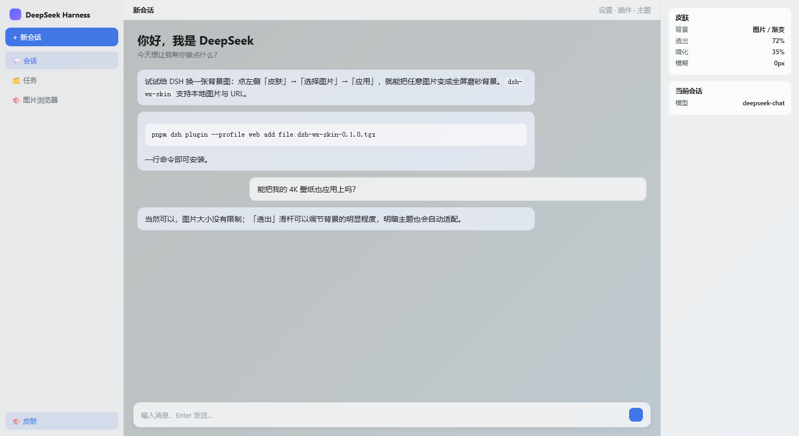

# 🎨 dsh-wx-skin

**DeepSeek Harness（DSH）Web GUI 皮肤插件** —— 侧栏「皮肤」面板，自选本地图片或图片 URL 作为全屏磨砂背景，支持预设、暗化、模糊与透出调节，明暗主题自动适配，跨刷新持久化。




> 上图为本插件实际效果演示(深蓝渐变壁纸透过半透明表面)。`assets/demo.html` 是自包含的演示源,可直接用浏览器打开预览。

---

## ✨ 功能特性

- **侧栏「皮肤」入口**,点击弹出设置面板(浮层,不遮挡聊天内容)。
- **本地图片**:浏览器原生文件对话框选择 PNG / JPEG / WebP / GIF / BMP,**不限文件大小**;按显示需要编码(≤4096px 保持原始分辨率,更大的自动缩放以保证浏览器可绘制、可持久化),选中后点「应用」生效。
- **图片 URL**:粘贴 `http(s)://` 图片地址直接应用。
- **预设皮肤**:墨蓝 / 石板 / 暖沙 / 落日渐变 / 深海渐变 / 极光渐变。
- **效果调节**:
  - 暗化 0–80%(黑色遮罩,保证文字可读);
  - 模糊 0–24px(背景毛玻璃);
  - **透出 50–100%**(表面不透明度,越低背景越明显,默认 72%)。
- **启用开关 + 恢复默认**,一键关闭皮肤。
- **持久化**:设置存于 `localStorage['dsh-wx-skin.settings']`,刷新、重启后自动恢复。
- **明暗主题适配**:随 `body[data-ds-dark-theme]` 自动切换两套半透明配色。
- **完全独立**:纯浏览器端 client 插件,不修改 DSH 仓库,不影响主界面与其它插件。

---

## 📦 安装

前置条件:已安装 [deepseek-harness](https://github.com/deepseek-ai/deepseek-harness) 并初始化 web profile。

### 方式一:从 npm 安装(推荐)

插件已发布到 npm,一条命令装齐(在 **DSH 源码 checkout 目录**执行):

```sh
pnpm dsh plugin --profile web add dsh-wx-skin@0.1.0
# 若 `dsh` 已加入 PATH,也可直接:
dsh plugin --profile web add dsh-wx-skin@0.1.0
```

### 方式二:使用发布包(tarball)

下载 `dsh-wx-skin-0.1.0.tgz`(或通过 GitHub Releases 获取):

```sh
pnpm dsh plugin --profile web add file:<tgz 的绝对路径>
# 例如:
pnpm dsh plugin --profile web add file:C:/Users/you/Downloads/dsh-wx-skin-0.1.0.tgz
```

### 方式三:克隆源码构建(开发者)

```sh
git clone <本仓库地址>
cd dsh-wx-skin
npm install
npm run build

# 装进 web profile(从 DSH 源码 checkout 目录执行)
pnpm dsh plugin --profile web add link:<本目录绝对路径>
```

### 完成安装后

**重启 `dsh web`**,刷新 `http://127.0.0.1:3080`,侧栏出现「皮肤」入口即可使用。

验证是否挂载:

```sh
pnpm dsh --profile web --dump-config   # 应看到 "# == dsh-wx-skin" 层
```

---

## 🚀 使用

1. 点击侧栏「皮肤」打开面板。
2. **选背景**:
   - 点「选择图片」→ 选择本地图片 → 显示缩略图 → 点「应用」;
   - 或粘贴图片 URL → 点「应用」;
   - 或直接点一个预设色板。
3. **调效果**:拖动「暗化」「模糊」「透出」滑杆实时预览。
4. 「启用皮肤」开关控制总开关;「恢复默认」一键还原。

---

## 🗑️ 卸载

```sh
pnpm dsh plugin --profile web remove dsh-wx-skin
```

重启 `dsh web` 后入口消失,皮肤设置一并清除。

---

## ⚙️ 工作原理

- **形态**:外部 client 插件(参考 [dsh-web-ui](https://github.com/zhu1090093659/dsh-web-ui) 模式)——`package.json` 声明 `dsh.client`(浏览器半区)+ `dsh.bundle.patch`(`cordis.patch.yml` 插入加载行),构建产物经 tsdown 输出为 `lib/client.js`,由 DSH 的 client-modules 在 `/plugins/dsh-wx-skin/client.js` 提供。
- **背景层**:注入全屏 `div[data-wx-skin-layer]`(`position: fixed; z-index: 0; pointer-events: none`),并将应用根 `#root` 抬到 `z-index: 1`。⚠️ 实测 **`z-index: -1` 的 fixed 图层在 DSH shell 中不绘制**(落在 canvas 背景之下),这是早期版本"能选图但背景不显示"的根因,故采用 `z-index: 0` + `#root` 抬升方案。
- **半透明表面**:以独立 `<style>` + `!important` 覆盖十余个 alias 表面 token(`--dsw-alias-bg-*`、`--dsw-specific-*`、`--dsw-alias-markdown-*` 等),明暗两套值;透明度由 `--wx-skin-surface` 变量统一控制(不依赖 `color-mix()`,任意现代浏览器可用)。
- **图片管线**:canvas 解码 → 编码为 JPEG data URL;原始分辨率 ≤4096px 时保持原样,更大或超出浏览器存储容量时静默缩小;编码结果做有效性校验,异常自动降档重编——**永不因图片大小报错**。
- **不依赖 `ctx.theme` 服务**:皮肤完全独立于 DSH 主题系统,关闭时样式惰性、默认主题不受影响。

---

## 🛠️ 开发

```sh
npm install          # 安装依赖
npm run typecheck    # tsc 类型检查(宿主 + 客户端)
npm run test         # vitest 单元测试(skin-store / image-pipeline)
npm run build        # tsc 宿主 lib + tsdown client bundle
npm pack             # 产出发布包 dsh-wx-skin-0.1.0.tgz
```

改完源码:`npm run build` → 重启 `dsh web` → 刷新页面。

---

## 📁 项目结构

```
dsh-wx-skin/
├── assets/
│   ├── demo.png          # README 效果截图
│   └── demo.html         # 自包含演示页(浏览器直接打开)
├── src/
│   ├── index.ts          # 宿主半区:空 apply(占加载行)
│   ├── core/types.ts     # 共享类型(SkinSettings)
│   └── client/
│       ├── index.ts      # 浏览器半区入口(apply)
│       ├── mount.tsx     # 侧栏入口 + 弹出面板的 DOM 注入(自愈挂载)
│       ├── SkinPanel.tsx # 设置面板(选图 / URL / 预设 / 滑杆 / 恢复默认)
│       ├── skin-store.ts # 纯逻辑:默认值、持久化、预设、CSS 变量映射
│       ├── image-pipeline.ts # 图片 → 降采样 → data URL(依赖注入,可测)
│       ├── skin-dom.ts   # 全局样式 / 背景层 / 应用到文档
│       ├── global-skin-css.ts # 皮肤全局样式表(背景层 + 半透明表面 + 明暗适配)
│       └── skin.module.css   # 面板 / 侧栏入口样式
├── tests/                # vitest 测试
├── cordis.patch.yml      # 插件加载行补丁
└── package.json          # dsh.client / dsh.bundle.patch 声明
```

---

## 📋 兼容性与注意事项

- **DSH 版本**:插件为纯浏览器端 + 单个 cordis 行,对 DSH 版本不敏感;但侧栏入口依赖 shell 的 DOM 结构(`[data-pane="sidebar"]` / `[class*="logoRow"]` / `[class*="newSession"]`)。若 DSH 版本变更导致入口未出现,只会记录日志、不影响 GUI,可反馈后调整选择器。
- **存储**:本地图片以 data URL 存于 `localStorage`(单浏览器场景,足够背景图使用);超大图会自动缩放至可持久化尺寸。
- **格式**:仅接受位图(PNG / JPEG / WebP / GIF / BMP);SVG 等矢量格式不支持(canvas 管线只处理位图,安全可预测)。
- **依赖 `#root`**:皮肤通过将应用根 `#root` 抬升到 `z-index: 1` 使背景层位于应用之下,请确保 shell 的挂载根仍为 `#root`(DSH 默认如此)。

---

## 📄 License

[MIT](LICENSE)
