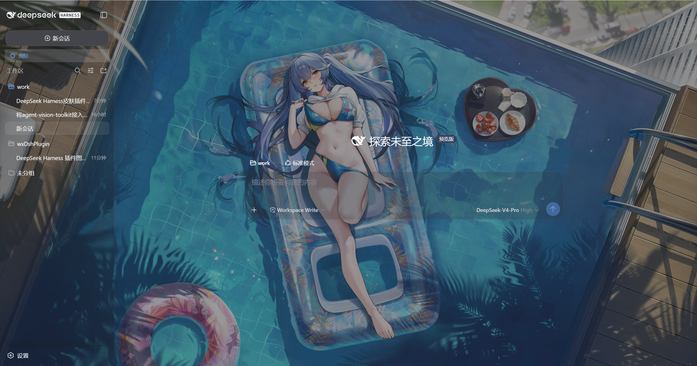

# 🎨 dsh-wx-skin

**DeepSeek Harness（DSH）Web GUI 皮肤插件** —— 在 **设置 → 皮肤** 里指定图片文件夹或本地图片作为全屏磨砂背景，支持暗化、模糊与透出调节，明暗主题自动适配，跨刷新持久化。




> 上图为本插件实际效果演示(深蓝渐变壁纸透过半透明表面)。`assets/demo.html` 是自包含的演示源,可直接用浏览器打开预览。

---

## ✨ 功能特性

- **设置里的「皮肤」页**:所有皮肤设置挂进 harness **自带设置面板**的官方加法页位 `settings.section`——点侧栏 ⚙ 设置,左栏多出「皮肤」一项,内容列按设置面板既有的内边距与滚动渲染,不再有会超出窗口的浮层。
- **侧栏底部换图快捷键**:「上一张」「下一张」以**一次注册**挂进官方 `sidebar.footer.action` 插槽(设置行上方),不打开设置也能一键换图;侧栏收成 56px 图标轨时自动变成两个图标按钮。
- **两行路径,一个模型**:设置页只有「文件夹」和「本地文件」两行,不再有「背景来源」下拉框。
  - **文件夹**:当前文件夹的路径(可用 harness 宿主目录选择器,也可手填绝对路径)。
  - **本地文件**:当前背景图片的**完整路径**;背景来自 URL 时这里显示 URL;用浏览器文件对话框选图且浏览器不给目录时显示文件名并给出提示。
  - **选文件自动带出文件夹**:在「本地文件」行粘贴一个图片绝对路径并点「应用」,插件读盘扫描它所在的文件夹,把该文件设为当前背景,并**按目录顺序从它继续**切换。
  - **对话框选图也会接上文件夹**:浏览器文件对话框不给目录,但只要**已加载的文件夹里恰有一张同名图片**,点「应用」时就会定位到它——背景变成那张、完整路径显示在「本地文件」行、「下一张 / 上一张」从它继续(选 bg129,下一张就是 bg130)。同名图片不止一张(递归扫到的不同子文件夹)时不做猜测,退回编码图并给出提示。
  - **选文件夹自动带出文件**:加载文件夹后,当前那张的完整路径会显示在「本地文件」行。
- **本地图片**:浏览器原生文件对话框选择 PNG / JPEG / WebP / GIF / BMP,**不限文件大小**;按显示需要编码(≤4096px 保持原始分辨率,更大的自动缩放以保证浏览器可绘制、可持久化),选中后点「应用」生效。⚠️ 浏览器(含 Electron 43)的文件对话框**不提供目录**,所以这条路本身拿不到路径;文件夹已加载时按上面的「同名匹配」接上轮播,否则可把完整路径粘到「本地文件」行。
- **图片 URL**:在「本地文件」行粘贴 `http(s)://` 图片地址再点「应用」,即按 URL 作为背景(该行同时就是当前图片路径 / URL 的显示位)。
- **文件夹轮播**:指定一个本地文件夹(可调用 harness 的宿主目录选择器,也可手填绝对路径),插件读盘列出其中所有图片并**缓存路径**;「下一张」按你选的模式换图:
  - **顺序**:按文件名自然排序(数值感知,`img2` 在 `img10` 之前)**逐张推进,两端回绕**——选到第 10 张,「下一张」就是第 11 张,「上一张」就是第 9 张;
  - **随机**:从未切换的图片里等概率抽取;
  - **随机模式一轮内不重复**:已切换过的图片会被记录,只有本轮图片全部切过之后才重置队列;重置后的第一张不会与当前这张重复(只有一张时除外)。顺序模式按目录顺序走,天然不会在回绕前重复。
  - 可选「包含子文件夹」;单次最多缓存 2000 张、遍历 20000 项、递归深度 6,达上限时设置页会提示已截断。
  - **上一张**:顺序模式回到目录里的上一张(首张回绕到末张),随机模式回到**上一次显示过的那张**;无路可退时按钮与侧栏快捷键置灰。
  - **自动同步**:回到页面/切回标签页、每 60 秒、以及打开设置页时都会重新读盘扫描该文件夹;新增的图片进入列表,**当前图片不会被重置**;已删除的图片会被移出(当前那张被删时按原序号就近落位)。
- **背景预览**:设置页顶部一块大预览(`height: min(36vh, 340px)` + `background-size: contain`),**完整显示**当前背景整张图(不裁切,两边留白),背景未启用时显示「未启用」。
- **当前图片名称**:设置页在「当前：」下方显示正在使用的图片名称——文件夹显示当前那张的文件名、本地图片显示所选文件名、URL 显示路径末段(如 `photo.jpg`);过长自动省略,悬停可看到完整路径 / URL;未启用或没有背景时不显示这一行。侧栏「下一张」快捷键的悬停提示也带上当前名称。
- **适合度**:背景图如何铺满窗口,和 Windows 壁纸的「选择适合度」同款语义:
  - **填充**(默认):铺满窗口,超出的裁掉;
  - **适应**:完整显示整张图,按比例缩放并留白;
  - **拉伸**:拉满窗口,比例可能变形;
  - **平铺**:按图片原始尺寸重复铺满;
  - **居中**:按原始尺寸居中,四周留白。
  (Windows 还多一个「跨区」,那是多显示器概念——浏览器只有一个视口,因此不提供。)
- **效果调节**:
  - 暗化 0–80%(黑色遮罩,保证文字可读);
  - 模糊 0–24px(背景毛玻璃);
  - **透出 0–100%**(表面不透明度,越低背景越明显,默认 72%;可读性由「暗化」配合)。
- **启用开关 + 恢复默认**,一键关闭皮肤。
- **持久化**:设置同时存于 `localStorage` 与宿主副本 `~/.dsh/dsh-wx-skin.settings.json`,刷新、重启、桌面端换端口后均自动恢复;文件夹轮播的图片列表、当前序号、本轮已用记录同样持久化(只存路径,不存图片本体,不占 localStorage 配额)。
- **明暗主题适配**:随 `body[data-ds-dark-theme]` 自动切换两套半透明配色;设置页自身也跟随明暗主题(暗色模式为深色控件 + 浅色文字),`color-scheme` 让页内的勾选框、滑杆、滚动条与页面同色系。
- **参与 harness 生命周期**:浏览器半区通过 `ctx.effect` 注册挂载,设置页与侧栏入口都通过官方插槽注册;client-hmr 重载或插件行停用时会被完整卸载(插槽注册、背景层、样式表全部移除,不残留、不重复)。
- **完全独立**:纯浏览器端 client 插件,不修改 DSH 仓库,不影响主界面与其它插件。

---

## 📦 安装

前置条件:已安装 [deepseek-harness](https://github.com/deepseek-ai/deepseek-harness),并已初始化目标 profile(Web 用 `web`,官方桌面端用应用自带的 `desktop`)。

### 方式一:从 npm 安装(推荐)

插件已发布到 npm,一条命令装齐(在 **DSH 源码 checkout 目录**执行):

```sh
pnpm dsh plugin --profile web add dsh-wx-skin@0.2.1
# 若 `dsh` 已加入 PATH,也可直接:
dsh plugin --profile web add dsh-wx-skin@0.2.1
```

### 方式二:使用发布包(tarball)

下载 `dsh-wx-skin-0.2.1.tgz`(或通过 GitHub Releases 获取):

```sh
pnpm dsh plugin --profile web add file:<tgz 的绝对路径>
# 例如:
pnpm dsh plugin --profile web add file:C:/Users/you/Downloads/dsh-wx-skin-0.2.1.tgz
```

### 方式三:克隆源码构建(开发者)

```sh
git clone <本仓库地址>
cd dsh-wx-skin
npm install
npm run build

# 装进 web profile(从 DSH 源码 checkout 目录执行)
pnpm dsh plugin --profile web add link:<本目录绝对路径>
```

### 方式四:官方桌面端(Electron Desktop,`apps/desktop`)

桌面端拥有自己的 profile `$DSH_HOME/profiles/desktop`(与 web 的 `profiles/web` **互不共享可执行包**),并且官方约定 **CLI 不修改该 profile**——请在应用内安装:

1. 打开桌面端 → **设置 → 插件 → 安装**;
2. 在输入框粘贴本插件的**绝对路径**(安装向导里的「本地插件目录」形态),例如:

   ```text
   E:/code/work/wxDshPlugin/dsh-wx-skin
   ```

   > `link:` / `file:` 前缀与裸绝对路径都被接受(`parseInstallSpec` 把它们读成 path 形态);npm 包名 `dsh-wx-skin@0.2.1` 与 tarball 路径同样可用。
3. 从开发菜单执行「**重启应用与 Host**」(或退出并重新打开应用)——宿主半区的路由与 client bundle 的清单都在启动时确定。

安装后与 web 端一样:**设置 → 皮肤**。桌面端与 web 端共用同一份 `$DSH_HOME/dsh-wx-skin.settings.json`,所以两端看到的是同一张壁纸与同一个文件夹队列。

> 桌面端**不需要**额外的构建步骤:它加载的正是 web 客户端,插件 bundle 由桌面端自己的 Host(默认 `127.0.0.1:19387`)提供。

### 完成安装后

**重启 `dsh web`**,刷新 `http://127.0.0.1:3080`,打开 **设置 → 皮肤** 即可使用(侧栏底部另有「上一张 / 下一张」换图快捷键)。

验证是否挂载:

```sh
pnpm dsh --profile web --dump-config   # 应看到 "# == dsh-wx-skin" 层
```

---

## 🚀 使用

1. 打开侧栏的 **⚙ 设置**,在左栏选 **皮肤**。
2. **选背景**:页面只有「文件夹」和「本地文件」两行(效果滑杆与恢复默认始终可见):
   - **选文件夹**:点「选择文件夹」(调用宿主目录选择器)或直接粘贴绝对路径 → 点「加载」;加载后当前那张的完整路径会显示在「本地文件」行,状态行显示 `第 n/N 张`;
   - **选本地文件**:点「选择图片」用系统文件对话框 → 显示缩略图 → 点「应用」——若已加载的文件夹里有同名图片,会自动定位到它并从这里继续切换;或在「本地文件」行**粘贴图片的绝对路径**再点「应用」,插件会切到该文件所在文件夹,并从这个文件开始按目录顺序切换;
   - **图片 URL**:把 `http(s)://` 地址粘贴到「本地文件」行 → 点「应用」。
3. **换图**:点设置页里的「下一张」,或侧栏底部的「下一张」快捷键(无需打开设置);切换方式在「顺序 / 随机」之间选;「重新加载」重新读盘以纳入新增/删除的文件(随机模式下可用「重置本轮」清空本轮记录);点「上一张」回退——**顺序模式就是目录里的上一张/下一张**(选到第 10 张,下一张 11、上一张 9),随机模式回到上一次显示的那张。**未加载任何文件夹时「下一张」什么都不做**(快捷键置灰并提示先加载文件夹)。 文件夹内容变化会被自动同步(回到页面、切回标签页或每 60 秒),也可点「重新加载」立即重扫。
4. **调效果**:拖动「暗化」「模糊」「透出」滑杆实时预览;上面一行「适合度」下拉框决定背景图如何铺满窗口(填充 / 适应 / 拉伸 / 平铺 / 居中)。
5. 「启用皮肤」开关控制总开关;「恢复默认」一键还原(同时清空文件夹缓存)。

> ⚠️ 文件夹轮播需要**宿主半区**读盘,因此首次升级到 0.1.x 后要**重启一次 `dsh web`**;只改浏览器半区时才可依赖 client-hmr 热重载。

---

## 🗑️ 卸载

```sh
pnpm dsh plugin --profile web remove dsh-wx-skin
```

重启 `dsh web` 后设置页与快捷键消失,皮肤设置一并清除。

---

## ⚙️ 工作原理

- **形态**:外部 client 插件(参考 [dsh-web-ui](https://github.com/zhu1090093659/dsh-web-ui) 模式)——`package.json` 声明 `dsh.client`(浏览器半区)+ `dsh.bundle.patch`(`cordis.patch.yml` 插入加载行),构建产物经 tsdown 输出为 `lib/client.js`(闭包工厂 `window.__ModuleLoader__.load({id, factory})`),由 DSH 的 client-modules 提供(DSH 0.1.5 起 bundle 引用带 `rev`;0.1.7 起该引用为**文档相对**形式 `plugins/??<id>/client.js&rev=<rev>`,由 `<base href="./">` 解析到当前挂载,并由 client-hmr 轮询 bundle 变更后热重载)。
- **设置页**:皮肤设置作为**独立一页**挂进 harness 官方设置面板的加法页位 `settings.section`(`ctx.slots.inject` + `ctx.slots.register({name, id: 'skin', order: 30, label: '皮肤'}, SkinSettings)`)。shell 拥有这个 800×800 面板:左栏按 `order` 列出各注册页并解析 `label`,内容列按既有内边距(`padding: 0 24px 24px`)与滚动渲染选中页,占用者收到 owner props `{ close }`(本插件不用——关闭走面板自身的关闭按钮 / Esc)。**皮肤不再自带浮层**:侧栏脚部的锚点离窗口底边太近,浮层必然越出视口,把设置放进设置面板才是最稳的落点。
- **侧栏换图快捷键**:「上一张 / 下一张」以**一次注册**挂进官方 `sidebar.footer.action` 插槽(`{name, id: 'skin-slideshow', order: 10, label: '换图'}`),由 shell 负责位置、排序与卸载;占用者收到 owner props `{ wide }`——`wide` 为真渲染整行两个等分按钮(图标 + 文字),为假(56px 图标轨)渲染两个 28px 图标。插件**不再**查询 `sidebarCol` / `logoRow` / `newSession` 等 shell 内部类名,也不再向侧栏 DOM 注入或挂 MutationObserver。
  - **为什么是一次注册**:该插槽的每一项都渲染成同一 flex 行的直接子节点,而随 DSH 发布的 `cordis-panel`(ui-cordis)占用者用 `width: 100%; flex: none` 独占整行;若注册两个同级项,排在其后的项会被压成 0 宽。整组一个占用者即把布局收回自己手里。
  - **并排共存**:分组挂载时把自己所在的那一行设为 `flex-wrap: wrap`(只改 shell 交给它的那个父元素,卸载时还原),这样多个占满整行的占用者各占一行、互不裁剪。
- **生命周期**:`src/client/index.ts` 的 `apply(ctx)` 用 `ctx.effect(() => …)` 建立控制器并在其中注册两个插槽。harness 的客户端热重载(client-hmr)与插件行停用都是“先卸载旧 fiber(跑 disposer)、删掉该插件拥有的 `<style data-plugin>`,再重新 apply”,因此必须把清理交给 fiber:否则每次重载都会多出一份设置页与一组快捷键。挂载失败时记录日志并 `teardownSkinDom()` 清理半成品,绝不外抛。
- **作用域可选依赖**:`slots` 与 `uiWorkspace` 都用 `ctx.inject([...], scope => …)` 的**子作用域**形式声明,而不是插件的 `inject`——`uiWorkspace` 要等客户端↔宿主连接就绪才 provide(比 `apply` 晚),而 `inject: ['slots']` 会让整个浏览器半区(含背景层与持久化)一起等待,并多一个启动审计失败面。`settings.section` / `sidebar.footer.action` 的**声明**到达时才建立注册,ui-settings / ui-sidebar 热重载(声明 epoch 变化)会自动反向清理并按新声明重建。
- **背景层**:注入全屏 `div[data-wx-skin-layer]`(`position: fixed; z-index: 0; pointer-events: none`),并将应用根 `#root` 抬到 `z-index: 1`。⚠️ 实测 **`z-index: -1` 的 fixed 图层在 DSH shell 中不绘制**(落在 canvas 背景之下),这是早期版本"能选图但背景不显示"的根因,故采用 `z-index: 0` + `#root` 抬升方案。铺图方式由「适合度」决定:applier 把模式投影成 `--wx-skin-bg-size` / `--wx-skin-bg-repeat` / `--wx-skin-bg-position` 三个变量,图层用它们取 `background-size/repeat/position`(默认值即「填充」)。
- **半透明表面**:以独立 `<style>` + `!important` 覆盖二十五个表面 token(`--dsw-alias-bg-*`、`--dsw-specific-*`、`--dsw-menu-surface-fill`、`--dsw-alias-markdown-*`、`--dsw-alias-file-diff-*-bg/-gutter`),明暗两套值;透明度由 `--wx-skin-surface` 变量统一控制(不依赖 `color-mix()`,任意现代浏览器可用)。其中 0.1.7 把 `--dsw-specific-menu` 改成字面量 rgba,0.1.7-rc 又把所有下拉/右键菜单/列表框迁到 `MenuSurface` 原语的新令牌 `--dsw-menu-surface-fill`(菜单内的吸顶分组标题仍读旧令牌,两个都覆盖才不会出现菜单头尾深浅不一)、并把改动文件的 diff 行从 8%/12% 的 `color-mix` 换成不透明字面量——这三批都被重新绑回滑块。该样式表带 `data-plugin="dsh-wx-skin"` 归属标记(与官方 CSS loader 一致):client-modules 会把未标记的 `<style>` 认领给下一个物化的插件,client-hmr 又按此属性删除插件拥有的样式,不标记就可能被别的插件连带删除。
- **图片管线**:canvas 解码 → 编码为 JPEG data URL;原始分辨率 ≤4096px 时保持原样,更大或超出浏览器存储容量时静默缩小;编码结果做有效性校验,异常自动降档重编——**永不因图片大小报错**。
- **宿主持久化**:`src/index.ts` 通过 `webServer` 服务注册 `/dsh-wx-skin/load` 与 `/dsh-wx-skin/save` 两条本机路由(注册键保持根绝对),把设置原子写入 DSH home(`$DSH_HOME` 或 `~/.dsh`)下的 `dsh-wx-skin.settings.json`;桌面端每次启动端口变化、localStorage 清空时,客户端自动从宿主副本恢复——背景图片跨会话不丢失。浏览器侧只使用**文档相对**引用(`dsh-wx-skin/load`),经 shell 注入的 `<base href="./">` 解析到当前挂载,因此在带前缀剥离代理的部署下同样命中;官方桌面端加载 `dsh-app://app/`,相对引用同样落在文档根。
- **文件夹轮播**:
  - `POST /dsh-wx-skin/folder` 读盘扫描(可选递归),只收 `png/jpg/jpeg/webp/gif/bmp`,跳过隐藏项与符号链接,按 `rel` 自然排序后返回路径列表;上限 2000 张 / 20000 项 / 深度 6,超限返回 `truncated`。客户端把列表、当前序号、本轮已用路径一起持久化(只存路径)。
  - `GET /dsh-wx-skin/image?p=<绝对路径>&v=<mtime>` 逐个回传图片字节,**只服务上一次成功扫描的根(或设置文件里的 `folderPath`)之内的文件**:`realpath` 归一 + 分隔符前缀比较(Windows 忽略大小写)+ 扩展名白名单 + 必须是文件;`v` 用 mtime 做缓存令牌,文件改动即换 URL。跨站请求(`Sec-Fetch-Site: cross-site`)直接拒绝,响应带 `X-Content-Type-Options: nosniff`。
  - 切换算法在 `src/client/skin-folder.ts`(纯函数、注入 rng):**顺序模式按目录顺序 +1 / -1 并两端回绕**(选到第 10 张就继续 11 / 回到 9),随机模式在**未切换集合**中等概率抽取;集合为空时才开启新一轮,并排除当前这张以避免立即重复。本轮记录只服务随机模式,按路径而非下标保存,文件夹内容变化时自动丢弃失效项。
  - 同一文件里的 `matchFolderImageByName` / `focusFolderImage` 负责「按文件名把对话框选中的图接回文件夹」:唯一同名才定位,同名歧义直接放弃(宁可显示编码图,也不默默显示错的那张);定位会同时清掉不再使用的 data URL / URL,持久化里不会残留两套来源。
  - 路径词汇在 `src/client/skin-path.ts`(纯字符串):判断 URL / 绝对路径、「本地文件」行的路径属于哪个文件夹(`parentDirectory`)、以及宿主规范化路径与用户输入是否为同一文件(`samePath`,Windows 忽略大小写与分隔符)。
   - 「选择文件夹」按钮调用**载体自己的**目录选择器,由 `src/client/skin-picker.ts` 的桥在两种载体间择优:官方桌面端由 preload 提供的 `globalThis.__DSH_DIRECTORY_PICKER__`(绑定应用窗口的 Electron 对话框,页面脚本执行前就已就绪)、其余部署回落到 harness 客户端服务 `uiWorkspace.pickDirectory()`。后者由 `ui-workspace` 提供,而它自己 inject 了 `remote.directoryPicker` 等依赖,即**只有客户端↔宿主连接就绪后才会 provide**——比本插件的 `apply` 晚。因此插件用 `ctx.inject(['uiWorkspace'], scope => …)` 把该服务当作**作用域可选依赖**(不是插件的 `inject`,插件不会因此等待),并让桥**懒读取**两者:载体能力变化时通知设置页重渲染,按钮始终可见,都不可用时置灰并提示;缺失或不可用时仍可用手填路径。
   - 设置页里的「下一张」在未加载文件夹时禁用;侧栏「下一张」快捷键同样置灰(`data-empty`)且点击不产生任何副作用。
- **不依赖 `ctx.theme` 服务**:皮肤完全独立于 DSH 主题系统,关闭时样式惰性、默认主题不受影响。
- **设置页配色**:设置页自带一套语义变量 `--wx-panel-*`(浅色默认 + `body[data-ds-dark-theme]` 覆盖),页面区**刻意不引用 `--dsw-alias-*`**:alias 令牌会随主题反转(暗色下 `--dsw-alias-label-primary` 近白、`--dsw-alias-border-l1` 近透明),而页内控件的底色调过,二者叠加就会出现"浅底浅字"。每个变量都带与官方 `--dsw-static-*` 令牌等值的字面量回退,并由 `tests/panel-theme.spec.ts` 校验两套调色板的文字对比度(≥4.5:1)与结构。

---

## 🛠️ 开发

```sh
npm install          # 安装依赖
npm run typecheck    # tsc 类型检查(宿主 + 客户端)
npm run test         # vitest 单元测试(skin-store / skin-folder / folder-scan / skin-host / skin-picker / image-pipeline / client-lifecycle / panel-theme / global-skin-css / route-resolution)
npm run build        # tsc 宿主 lib + tsdown client bundle
npm pack             # 产出发布包 dsh-wx-skin-<version>.tgz
```

改完源码:`npm run build` → 重启 `dsh web` → 刷新页面。仅改浏览器半区(`lib/client.js`)时,harness 的 client-hmr 会轮询 bundle 变更并热重载该行,不必重启服务。

---

## 📁 项目结构

```
dsh-wx-skin/
├── assets/
│   ├── demo.png          # README 效果截图
│   └── demo.html         # 自包含演示页(浏览器直接打开)
├── src/
│   ├── index.ts          # 宿主半区:设置持久化 + 文件夹扫描 + 图片回传路由
│   ├── folder.ts         # 宿主:文件夹扫描 / 位图白名单 / 路径收敛(io 注入,可测)
│   ├── core/types.ts     # 共享类型(SkinSettings / SkinFolderImage)
│   └── client/
│       ├── index.ts      # 浏览器半区入口(控制器 + 两个官方插槽注册 + 作用域可选依赖 + 失败清理)
│       ├── skin-controller.tsx # 皮肤控制器:设置状态与应用、轮播、持久化、重扫、订阅快照
│       ├── skin-settings.tsx # 设置页(注册进官方 settings.section 插槽)
│       ├── entries.tsx   # 侧栏脚部换图快捷键(注册进官方 sidebar.footer.action 插槽)
│       ├── SkinPanel.tsx # 受控设置页内容(文件夹 / 本地文件两行 + 切换 + 效果)
│       ├── skin-path.ts  # 纯逻辑:URL / 绝对路径判定、所在文件夹、路径同一性
│       ├── skin-folder.ts # 纯逻辑:排序、图片 URL、顺序/随机切换算法(注入 rng)
│       ├── skin-store.ts # 纯逻辑:默认值、localStorage、CSS 变量映射
│       ├── skin-host.ts  # 宿主调用(load / save / folder,文档相对 fetch,可注入)
│       ├── skin-picker.ts # 目录选择器桥(作用域可选依赖,懒读取)
│       ├── image-pipeline.ts # 图片 → 降采样 → data URL(依赖注入,可测)
│       ├── skin-dom.ts   # 全局样式 / 背景层 / 应用与卸载到文档
│       ├── global-skin-css.ts # 皮肤全局样式表(背景层 + 半透明表面 + 明暗适配)
│       └── skin.module.css   # 设置页 / 侧栏脚部快捷键样式
├── tests/                # vitest 测试(插槽生命周期、路由解析守卫、调色板守卫等)
├── cordis.patch.yml      # 插件加载行补丁
└── package.json          # dsh.client / dsh.bundle.patch 声明
```

---

## 📋 兼容性与注意事项

- **DSH 版本**:适配基准为 DSH `0.1.7-rc.2`(checkout tag `dsh-v0.1.7-rc.2`,commit `477b4f4205`,2026-09-24;上一基准为 `0.1.7-alpha.2` / `00102833df`)。逐项核对过的契约:
  - **客户端模块系统**:闭包工厂产物 `window.__ModuleLoader__.load({id, factory})`;平台模块表种子词与官方 `packages/client/web/src/platform.ts` 的 `PLATFORM_MODULES` 逐字一致(`react` / `react/jsx-runtime` / `react-dom` / `react-dom/client` / `@deepseek-ai/cordis` / `dsh-client-store` / `ui-slots` / `ui-primitives` / `ui-dockkit`);0.1.7 起 bundle 引用为文档相对(`plugins/??<id>/client.js&rev=<rev>`)、`rev` 由 bundle 文件元数据(mtime/ctime/size)生成,均由 shell 侧生成,插件不自行拼 URL。0.1.7-rc.2 未改动该契约(banner/footer/intro、CSS Modules 注入与 `data-plugin` 归属标记仍与 `packages/client/tsdown.client.ts` 一致)。
  - **插槽注册**:客户端服务名 `slots`;`ctx.slots.inject(key, cb)` 等待槽**声明**并把回调作为子 fiber effect 运行;`ctx.slots.register({name, id, order, label}, Component)` 的 list 槽按 `order` 升序渲染、**不额外包 DOM**。本插件使用两个官方加法页位:`settings.section`(`kind: 'list'`、`scope: 'root'`、`replaceRisk: 'none'`,owner props `{ close }`;内容列由 shell 提供内边距与滚动)与 `sidebar.footer.action`(同 kind/scope,owner props `{ wide }`;单次注册承载整组快捷键,该行的既有占用者会独占整行,见上文)。两个席位的 kind/scope/owner props 在 0.1.7-rc.2 均未变化(该版本给 `SidebarRootInjected.hooks` 加了 `shortcuts`、给 `settings.launcher` 加了 `settingsOpen`/`settingsShortcut`,都只影响本插件未使用的 owner)。
  - **宿主契约**:`webServer.register({kind:'exact', path, handler})`;cordis `ctx.effect` / `ctx.inject` / `ctx.logger`;`uiWorkspace.pickDirectory(): Promise<string | null>`(无 chooser 时 reject,设置页已吞异常)。
  - **样式契约**:`body[data-ds-dark-theme]` 明暗开关、`#root` 挂载根、本文覆盖的全部二十五个 `--dsw-*` 表面令牌(含 0.1.7 改为字面量 rgba 的 `--dsw-specific-menu`、0.1.7-rc 新增的 `--dsw-menu-surface-fill` 与四个 `--dsw-alias-file-diff-*`)。设置面板 0.1.7-rc 起改为 portal 到 `body`(与 `#root` 同级)并以 `z-index: 1000` 覆盖,插件抬升 `#root` 到 `z-index: 1` 因此不影响它;设面板仍以 `--dsw-alias-bg-layer-2` 作底色,skin 覆盖后照常透出。**不再依赖** `sidebarCol` / `logoRow` / `newSession` 等 shell 内部类名。
  - **路由约定**:目标为应用自有路由的浏览器引用一律文档相对(对齐官方 `verify-client-route-resolution` 门禁,该门禁的受管前缀与规则在 0.1.7-rc.2 未变;`<base href="./">` 仍由 `dsh-host-frontend-static` 注入),`tests/route-resolution.spec.ts` 在本地执行同类静态扫描。`--dsw-alias-bg-document-preview` 有意不覆盖(仅文档/PDF 预览正文使用,阅读需要不透明底)。
- **官方桌面端(`apps/desktop`)**:同一个 web 客户端跑在 Electron 壳里,插件**不需要独立构建**,但有两处载体差异已被专门处理:
  - **文档来源是 `dsh-app://app`**(`apps/desktop/src/main.ts` 的 `applicationUrl`),不是 `http://127.0.0.1:<port>`。壳把整篇文档交由 Electron 的 `protocol.handle` 转发给已认证的 Host,并在转发时**删掉** `origin` 与 `sec-fetch-site`(`apps/desktop/src/web-document.ts` 的 `forwardWebRequest`)。因此宿主守卫按「本地载体」放行:`dsh-app://app` 与回环 authority 同列白名单——`Origin` 对脚本是禁止修改的请求头,网页无法借用桌面端来源,放行它不会放宽这道「跨站浏览器」围栏。`tests/host-routes.spec.ts` 的 `desktop carrier` 用例固定了这两种请求形状。
  - **目录选择器**:桌面端由渲染进程 preload 在页面脚本执行前装好 `globalThis.__DSH_DIRECTORY_PICKER__`(`apps/desktop/src/preload-app.ts`,IPC 到 `dsh-desktop:directory-pick`),打开的是**绑定应用窗口**的 Electron 文件夹对话框——这正是 harness 自己的原生目录流程所驱动的那个(`ui-directory-picker-native` 的浏览器半区同样优先用它)。插件因此优先走它,只有在没有它的 Web 部署里才回落到 `uiWorkspace.pickDirectory()`;否则桌面端会去开宿主侧的 OS 选择器(桌面 Host 绑定回环,自适应选择器会解析成 `native`,于是同一次点击会开出第二个不受窗口约束的对话框)。
  - **不变量**:文档基址等价(桌面端窗口加载 `dsh-app://app/`,相对引用与 web 端的 `<base href="./">` 同解,`<base>` 由 `dsh-host-frontend-static` 单独注入、桌面端不经该路径);`localStorage` 可用(`registerSchemesAsPrivileged` 声明 `standard`+`secure`);`body[data-ds-dark-theme]`、`#root`、两个槽席位与 `webServer` 服务都与 web 端同源;`DSH_HOME` 未被桌面端改写,所以两端共用同一份设置文件。macOS 上桌面端新加的窗口拖拽行(`data-window-drag`)不影响皮肤:背景层是 `body > :not(#root)`,命中原有的 `no-drag` 规则,且 `pointer-events: none`。
- **生命周期约定**:插件必须通过 `ctx.effect` 归还副作用。client-hmr 重载与插件行停用都会先卸载旧 fiber,只有 fiber 上的 disposer 会执行;`dsh-wx-skin` 的两个插槽注册(React 组件由 shell 卸载)、背景层、样式表和文档属性都在这条路径上回收。
- **入口的降级**:设置页依赖 ui-settings 声明 `settings.section`,快捷键依赖 ui-sidebar 声明 `sidebar.footer.action`。若某个部署没有对应外壳(槽永不声明),插件**不会**因此等待或报错:背景、设置数据与持久化照常工作,只是那处入口不出现(这也是不用 `inject: ['slots']` 的原因)。侧栏折叠为图标轨时快捷键自动变成两个 28px 图标。
- **存储**:本地图片以 data URL 存于 `localStorage`(浏览器缓存/回退),并镜像到宿主副本 `~/.dsh/dsh-wx-skin.settings.json`(跨端口持久化);超大图会自动缩放至可持久化尺寸。文件夹轮播只持久化路径列表与序号,不占图片配额。
- **格式**:仅接受位图(PNG / JPEG / WebP / GIF / BMP);SVG 等矢量格式不支持(canvas 管线只处理位图,文件夹扫描也按白名单过滤,安全可预测)。
- **文件夹读取范围**:图片路由只服务「上一次成功扫描的根」或设置文件里 `folderPath` 之内的位图文件,来源限于本机载体(Web 的回环 authority,或官方桌面端的 `dsh-app://app` 文档)+ 非跨站才放行,无法被用作任意文件读取;宿主进程与文件夹必须在同一台机器(`dsh web` 的 GUI 与目录同机)。
- **宿主半区变更需重启**:新增/修改宿主路由(`src/index.ts`、`src/folder.ts`)后必须重启 `dsh web`;只改 `src/client/*` 时 client-hmr 会热重载,不必重启。
- **依赖 `#root`**:皮肤通过将应用根 `#root` 抬升到 `z-index: 1` 使背景层位于应用之下,请确保 shell 的挂载根仍为 `#root`(DSH 默认如此)。

---

## 📄 License

[MIT](LICENSE)
